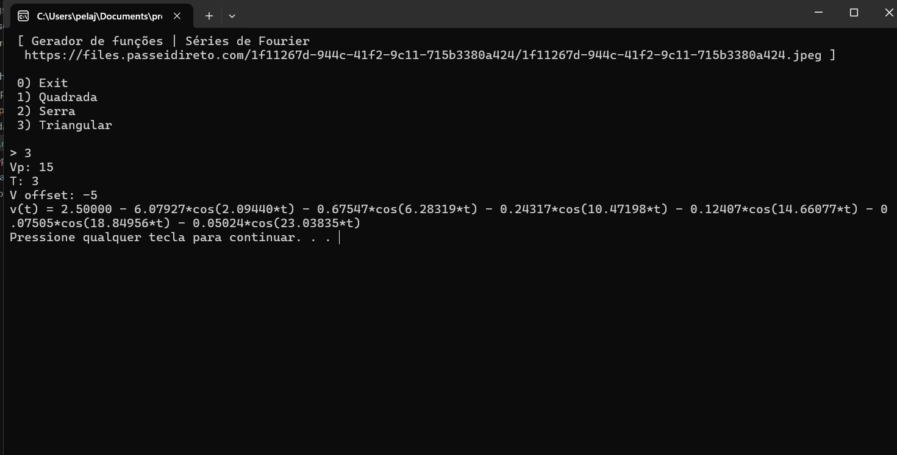
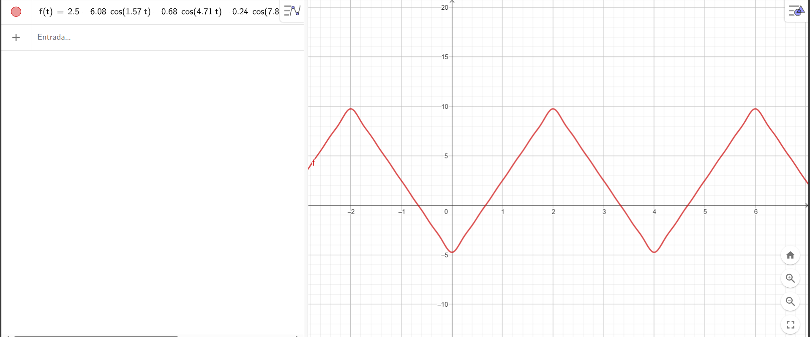

# Séries de fourier
[Série de Fourier é uma forma de série trigonométrica usada para representar funções infinitas e periódicas complexas dos processos físicos, na forma de funções trigonométricas simples de senos e cossenos. Isto é, simplificando a visualização e manipulação de funções complexas. Foi criada em 1807 por Jean Baptiste Joseph Fourier (1768-1830).](https://pt.wikipedia.org/wiki/S%C3%A9rie_de_Fourier)

# Como compilar
É necessário ter o compilador GCC/G++ instalado. Você pode encontrar [aqui](https://sourceforge.net/projects/mingw/)  
Instale o [VSCode](https://code.visualstudio.com/)  
   
Execute a task de compilação fornecida (Control + Shift + B)

# Como usar
1. Execute o programa  
2. Selecione o tipo de fonte desejada  
3. Informe a tensão de pico  
4. Informe o período  
5. Informe o offset  
6. Verifique o resultado:  
Cole a saida do programa "v(t) = ..." em um programa como o [GeoGebra](https://www.geogebra.org/classic)

